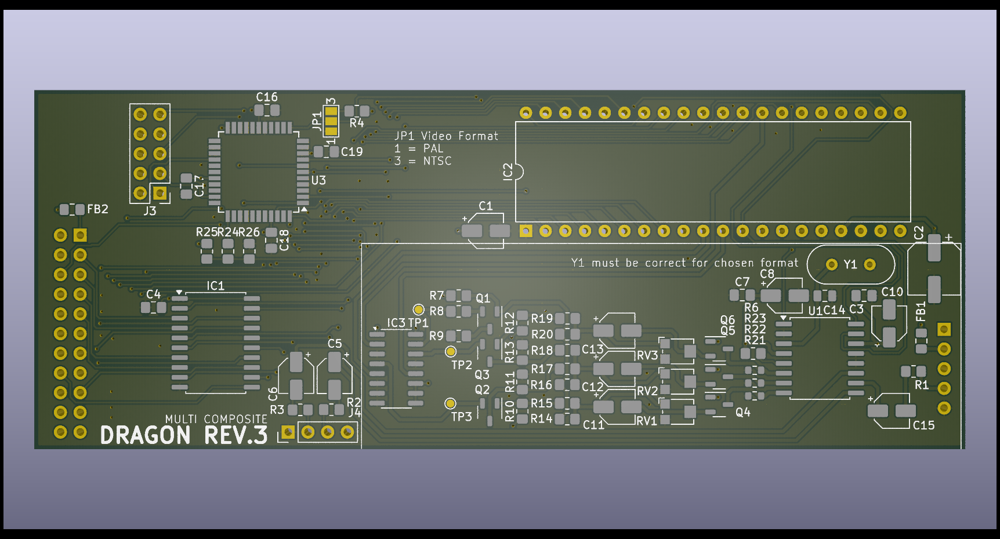

# Dragon PAL Video Board Concept 3 #
This repository contains the design for
a video board for the Dragon 32 rev 3 
evolution main board

## YUV -> RGB ##
The design here converts the YUV output 
of the VDG chip into RGB in order to
drive an Analog Devices AD724JR 
signal modulator

Translation is performed per channel to calculate
the relative R-Y and B-Y values that can be 
combined with an inverted Y signal to produce
RGB. Each output channel can then be fine tuned for
strength independently.

The resulting RGB signals are fed to the
AD724 which provides signal modulation and
synthesizes the sync signals. The original
sync in the source luma signal is ignored.
